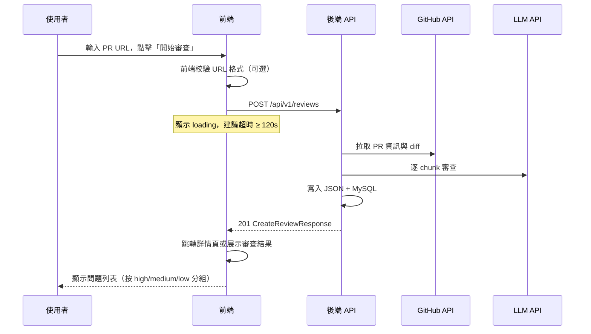
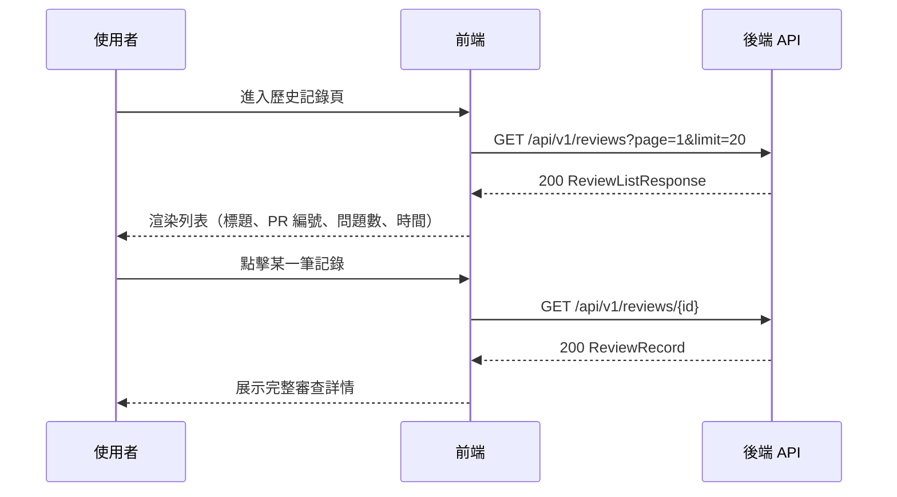
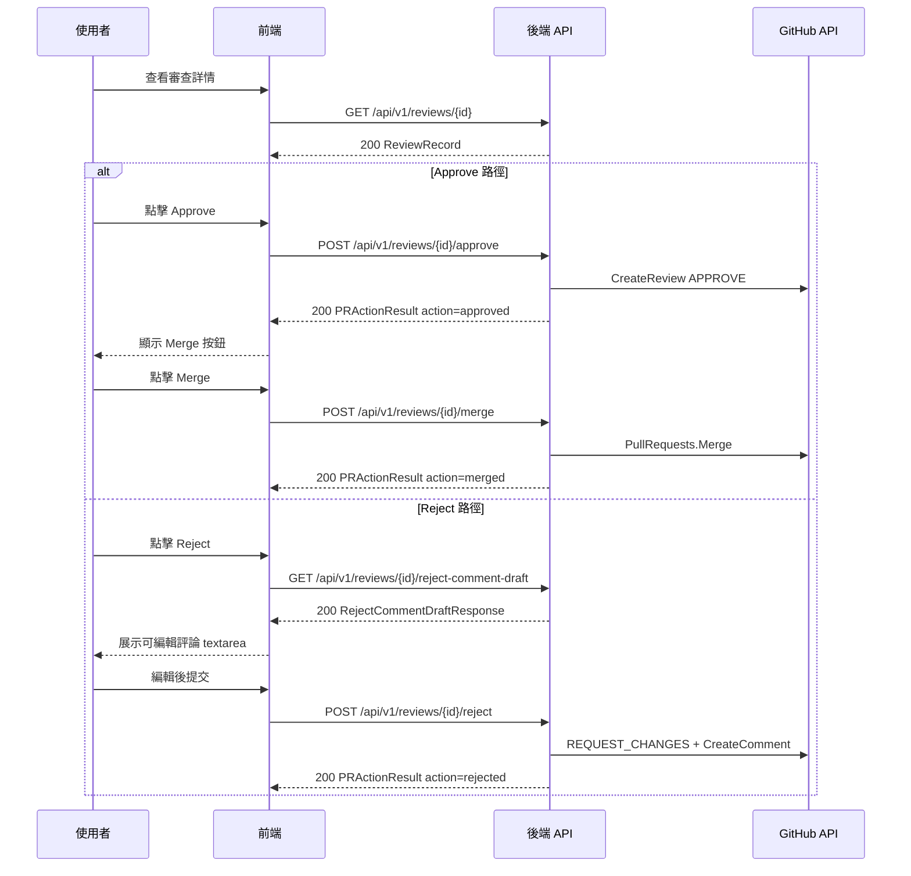

# AI PR Review API 文件

> 版本：`v1.1.0`  
> 對應 OpenAPI 規格：[`api/openapi.yaml`](api/openapi.yaml)  
> 最後更新：2026-05-30

本文件描述 **AI PR Review** 後端 REST API 的完整介面規範，供前端（Web / 桌面客戶端）整合使用。後端以 Go + Gin 實作，負責接收 GitHub PR URL、呼叫 AI 進行程式碼審查，並將結果持久化至 MySQL 與本地 JSON 檔案。

---

## 目錄

1. [概述](#概述)
2. [通用約定](#通用約定)
3. [端點總覽](#端點總覽)
4. [系統端點](#系統端點)
5. [審查端點](#審查端點)
6. [資料模型](#資料模型)
7. [前端互動流程](#前端互動流程)
8. [錯誤處理指南](#錯誤處理指南)
9. [前端整合範例](#前端整合範例)
10. [注意事項與限制](#注意事項與限制)

---

## 概述

### 服務位址

| 環境 | Base URL |
|------|----------|
| 本地開發 | `http://localhost:8080` |
| 生產環境 | 依部署配置而定（預設監聽 `0.0.0.0:8080`） |

啟動方式：

```bash
cd ai-pr-review
go run ./cmd/api
# 或
make run-api
```

### 業務流程

```
前端提交 PR URL
    → POST /api/v1/reviews
    → 後端拉取 GitHub diff
    → AI 逐 chunk 審查
    → 寫入 JSON + MySQL
    → 同步回傳完整審查結果（201）
```

前端可透過列表與詳情端點查詢歷史記錄，無需重複觸發審查。審查完成後，前端可透過 Approve / Merge / Reject 端點將決策同步至 GitHub。

### 認證

**對外 REST API 目前無認證機制**（無 JWT、API Key、Session）。所有端點均可匿名存取。若部署至公網，建議在反向代理層（如 Nginx）或 API Gateway 補充認證。

---

## 通用約定

### 請求格式

| 項目 | 規範 |
|------|------|
| 編碼 | UTF-8 |
| Content-Type | `application/json`（POST 請求必填） |
| Accept | `application/json`（建議） |

### 回應格式

- 成功：直接回傳業務 JSON 物件，HTTP 狀態碼為 `200` 或 `201`
- 失敗：統一錯誤結構

```json
{
  "error": "錯誤描述文字"
}
```

### 時間格式

所有 `created_at` 欄位使用 **RFC 3339** 格式（UTC），例如：

```
2026-05-29T16:00:00Z
```

### CORS

後端**尚未配置 CORS 中間件**。若前端與 API 不同源（例如前端 `localhost:3000`、API `localhost:8080`），需在開發環境透過代理轉發，或在後端補充 CORS 設定。

---

## 端點總覽

| 方法 | 路徑 | 說明 | 成功狀態碼 |
|------|------|------|------------|
| `GET` | `/health` | 健康檢查 | `200` |
| `POST` | `/api/v1/reviews` | 提交 PR 觸發審查 | `201` |
| `GET` | `/api/v1/reviews` | 分頁查詢審查歷史 | `200` |
| `GET` | `/api/v1/reviews/:id` | 依 ID 查詢審查詳情 | `200` |
| `POST` | `/api/v1/reviews/:id/approve` | 向 GitHub 提交 APPROVE review | `200` |
| `POST` | `/api/v1/reviews/:id/merge` | 合併 PR | `200` |
| `GET` | `/api/v1/reviews/:id/reject-comment-draft` | 取得 AI 打回評論草稿 | `200` |
| `POST` | `/api/v1/reviews/:id/reject` | 打回 PR 並發布評論 | `200` |

---

## 系統端點

### GET /health

用於負載均衡器、K8s 探針或前端啟動時檢測後端是否可用。

**請求參數：** 無

**成功回應 `200`：**

```json
{
  "status": "ok"
}
```

**前端建議：** 在應用初始化或設定頁面呼叫此端點，確認 API 連線正常後再開放審查功能。

---

## 審查端點

### POST /api/v1/reviews

提交 GitHub Pull Request URL，觸發同步 AI 程式碼審查。

> **重要：** 此端點為**同步阻塞**請求。後端會依序完成 GitHub 拉取、diff 解析、LLM 審查、檔案寫入與資料庫儲存後才回應。大型 PR 可能耗時數十秒至數分鐘，前端須設定足夠的請求超時並顯示 loading 狀態。

#### 請求

**Headers：**

```
Content-Type: application/json
```

**Body：**

| 欄位 | 類型 | 必填 | 說明 |
|------|------|------|------|
| `pr_url` | string | 是 | GitHub Pull Request 完整 URL |

**`pr_url` 格式要求：**

- 必須為 GitHub PR 連結
- 正則模式：`github.com/{owner}/{repo}/pull/{number}`（大小寫不敏感）
- 前後空白會自動去除
- 不支援 GitLab、Bitbucket 等其他平台

**有效範例：**

```
https://github.com/org/repo/pull/123
https://github.com/Org/Repo/pull/1
```

**無效範例：**

```
https://gitlab.com/org/repo/pull/1        → 非 GitHub
https://github.com/org/repo/issues/123    → 非 PR 連結
（空字串）                                  → pr_url is required
```

**請求範例：**

```json
{
  "pr_url": "https://github.com/org/repo/pull/123"
}
```

#### 回應

**成功 `201`：** 回傳 [`CreateReviewResponse`](#createreviewresponse)

```json
{
  "id": 1,
  "pr_title": "fix login",
  "pr_number": 123,
  "repo_name": "org/repo",
  "pr_url": "https://github.com/org/repo/pull/123",
  "ai_model": "deepseek-chat",
  "review_status": "completed",
  "total_issues": 2,
  "high_issues": 1,
  "medium_issues": 0,
  "low_issues": 1,
  "review_result": {
    "high": [
      {
        "file": "config.yaml",
        "line": 42,
        "message": "硬編碼敏感憑據：在配置文件中发现明文 token，存在泄露风险。",
        "suggestion": "移除硬編碼的 token，改為通過環境變數注入。"
      }
    ],
    "medium": [],
    "low": [
      {
        "file": "main.go",
        "line": 6,
        "message": "無限循環沒有退出條件，可能導致程序無法正常退出。",
        "suggestion": "考慮添加退出條件以便優雅關閉。"
      }
    ]
  },
  "raw_diff": "diff --git a/config.yaml b/config.yaml\n...",
  "created_at": "2026-05-29T16:00:00Z",
  "output_file": "output/fix_login.json"
}
```

**錯誤回應：**

| 狀態碼 | 情境 | `error` 範例 |
|--------|------|--------------|
| `400` | JSON 格式錯誤 | `invalid request body` |
| `400` | `pr_url` 缺失 | `pr_url is required` |
| `400` | `pr_url` 格式無效 | `invalid GitHub PR URL: ...` |
| `500` | GitHub API 失敗 | `fetch PR: get pull request: ...` |
| `500` | LLM 呼叫失敗 | `run review: ...` |
| `500` | 資料庫寫入失敗 | `save review: ...` |

---

### GET /api/v1/reviews

分頁查詢審查歷史記錄，適用於首頁列表、歷史記錄頁。

#### 請求

**Query 參數：**

| 參數 | 類型 | 必填 | 預設值 | 說明 |
|------|------|------|--------|------|
| `page` | integer | 否 | `1` | 頁碼，小於 1 時後端自動修正為 1 |
| `limit` | integer | 否 | `20` | 每頁筆數，範圍 `1–100`，超出會被 clamp |
| `pr_number` | integer | 否 | — | 依 PR 編號篩選；未傳或 `≤ 0` 時不篩選 |

**請求範例：**

```
GET /api/v1/reviews?page=1&limit=20
GET /api/v1/reviews?page=2&limit=10&pr_number=123
```

#### 回應

**成功 `200`：** 回傳 [`ReviewListResponse`](#reviewlistresponse)

```json
{
  "items": [
    {
      "id": 1,
      "pr_title": "fix login",
      "pr_number": 123,
      "total_issues": 2,
      "created_at": "2026-05-29T16:00:00Z"
    }
  ],
  "total": 1,
  "page": 1,
  "limit": 20
}
```

**排序：** 依 `created_at` 降序（最新在前）。

**分頁計算：**

```
總頁數 = Math.ceil(total / limit)
是否有下一頁 = page * limit < total
```

**錯誤回應：**

| 狀態碼 | 情境 |
|--------|------|
| `500` | 資料庫查詢失敗 |

---

### GET /api/v1/reviews/:id

依審查記錄 ID 查詢完整審查結果，適用於詳情頁。

#### 請求

**Path 參數：**

| 參數 | 類型 | 必填 | 說明 |
|------|------|------|------|
| `id` | integer (int64) | 是 | 審查記錄 ID，須為正整數 |

**請求範例：**

```
GET /api/v1/reviews/1
```

#### 回應

**成功 `200`：** 回傳 [`ReviewRecord`](#reviewrecord)

與 [`CreateReviewResponse`](#createreviewresponse) 結構基本相同，但**不含** `output_file` 欄位。

```json
{
  "id": 1,
  "pr_title": "fix login",
  "pr_number": 123,
  "repo_name": "org/repo",
  "pr_url": "https://github.com/org/repo/pull/123",
  "ai_model": "deepseek-chat",
  "review_status": "completed",
  "total_issues": 2,
  "high_issues": 1,
  "medium_issues": 0,
  "low_issues": 1,
  "review_result": {
    "high": [],
    "medium": [],
    "low": []
  },
  "raw_diff": "diff --git ...",
  "created_at": "2026-05-29T16:00:00Z"
}
```

**錯誤回應：**

| 狀態碼 | 情境 | `error` 值 |
|--------|------|------------|
| `400` | ID 非數字或 ≤ 0 | `invalid review id` |
| `404` | 記錄不存在 | `review not found` |
| `500` | 資料庫錯誤 | 具體錯誤訊息 |

---

### POST /api/v1/reviews/:id/approve

向 GitHub 提交 `APPROVE` review，對應 CLI 審查後的第一步「同意」操作。

#### 請求

**Path 參數：**

| 參數 | 類型 | 必填 | 說明 |
|------|------|------|------|
| `id` | integer (int64) | 是 | 審查記錄 ID |

**Body（可選）：**

| 欄位 | 類型 | 必填 | 說明 |
|------|------|------|------|
| `comment` | string | 否 | Approve review 附帶說明；未傳時使用 `review_result.pr_change_summary` |

**請求範例：**

```
POST /api/v1/reviews/1/approve
```

或帶自訂說明：

```json
{
  "comment": "LGTM，變更符合預期。"
}
```

#### 回應

**成功 `200`：** 回傳 [`PRActionResult`](#practionresult)

```json
{
  "review_id": 1,
  "action": "approved",
  "message": "PR approved on GitHub."
}
```

**錯誤回應：**

| 狀態碼 | 情境 | `error` 值 |
|--------|------|------------|
| `400` | ID 無效 | `invalid review id` |
| `400` | JSON 格式錯誤 | `invalid request body` |
| `404` | 記錄不存在 | `review not found` |
| `500` | GitHub API 失敗 | 具體錯誤訊息（含 403 權限不足等） |

---

### POST /api/v1/reviews/:id/merge

合併 PR，對應 CLI 審查後 approve 之後的第二步「merge」。前端應在 Approve 成功後再展示 Merge 按鈕。

#### 請求

**Path 參數：**

| 參數 | 類型 | 必填 | 說明 |
|------|------|------|------|
| `id` | integer (int64) | 是 | 審查記錄 ID |

**Body：** 無

**請求範例：**

```
POST /api/v1/reviews/1/merge
```

#### 回應

**成功 `200`：** 回傳 [`PRActionResult`](#practionresult)

```json
{
  "review_id": 1,
  "action": "merged",
  "message": "PR merged successfully."
}
```

**錯誤回應：**

| 狀態碼 | 情境 | `error` 值 |
|--------|------|------------|
| `400` | ID 無效 | `invalid review id` |
| `404` | 記錄不存在 | `review not found` |
| `500` | GitHub Merge 失敗 | 具體錯誤訊息（405 已合併/已關閉、422 branch protection 等） |

---

### GET /api/v1/reviews/:id/reject-comment-draft

取得 AI 審查結果自動生成的打回評論草稿，供前端填充可編輯 textarea。

#### 請求

**Path 參數：**

| 參數 | 類型 | 必填 | 說明 |
|------|------|------|------|
| `id` | integer (int64) | 是 | 審查記錄 ID |

**請求範例：**

```
GET /api/v1/reviews/1/reject-comment-draft
```

#### 回應

**成功 `200`：** 回傳 [`RejectCommentDraftResponse`](#rejectcommentdraftresponse)

```json
{
  "review_id": 1,
  "comment": "## AI PR Review — 请求修改\n\n**变更摘要：**\n...\n\n**问题统计：** 共 3 个（高 2 / 中 1 / 低 0）\n\n### 高优先级\n- `main.go:10` — ...\n  - 建议：..."
}
```

**錯誤回應：**

| 狀態碼 | 情境 | `error` 值 |
|--------|------|------------|
| `400` | ID 無效 | `invalid review id` |
| `404` | 記錄不存在 | `review not found` |
| `500` | 內部錯誤 | 具體錯誤訊息 |

---

### POST /api/v1/reviews/:id/reject

打回 PR：向 GitHub 提交 `REQUEST_CHANGES` review，並發布相同內容的 PR comment。

#### 請求

**Path 參數：**

| 參數 | 類型 | 必填 | 說明 |
|------|------|------|------|
| `id` | integer (int64) | 是 | 審查記錄 ID |

**Body：**

| 欄位 | 類型 | 必填 | 說明 |
|------|------|------|------|
| `comment` | string | 是 | 打回原因（可先透過 draft 端點取得草稿，編輯後提交） |

**請求範例：**

```json
{
  "comment": "## AI PR Review — 请求修改\n\n**变更摘要：**\n...\n\n请修复上述问题后重新提交。"
}
```

#### 回應

**成功 `200`：** 回傳 [`PRActionResult`](#practionresult)

```json
{
  "review_id": 1,
  "action": "rejected",
  "message": "Requested changes and posted comment on GitHub."
}
```

**錯誤回應：**

| 狀態碼 | 情境 | `error` 值 |
|--------|------|------------|
| `400` | ID 無效 | `invalid review id` |
| `400` | JSON 格式錯誤 | `invalid request body` |
| `400` | `comment` 為空 | `comment is required` |
| `404` | 記錄不存在 | `review not found` |
| `500` | GitHub API 失敗 | 具體錯誤訊息 |

---

## 資料模型

以下 TypeScript 介面可直接用於前端型別定義。

### 共用型別

```typescript
/** 統一錯誤回應 */
interface ErrorResponse {
  error: string;
}

/** 單一審查問題 */
interface ReviewIssueDetail {
  file: string;       // 檔案路徑
  line: number;       // 行號
  message: string;    // 問題描述
  suggestion: string; // 修復建議
}

/** 依嚴重度分組的審查結果 */
interface ReviewResultBySeverity {
  pr_change_summary?: string;
  high: ReviewIssueDetail[];
  medium: ReviewIssueDetail[];
  low: ReviewIssueDetail[];
}
```

### 請求型別

```typescript
/** POST /api/v1/reviews 請求體 */
interface CreateReviewRequest {
  pr_url: string;
}

/** POST /api/v1/reviews/:id/approve 請求體（可選） */
interface ApproveReviewRequest {
  comment?: string;
}

/** POST /api/v1/reviews/:id/reject 請求體 */
interface RejectReviewRequest {
  comment: string;
}
```

### 回應型別

```typescript
/** GET /health 回應 */
interface HealthResponse {
  status: string; // 固定為 "ok"
}

/** POST /api/v1/reviews 回應 */
interface CreateReviewResponse {
  id: number;
  pr_title: string;
  pr_number: number;
  repo_name?: string;
  pr_url: string;
  ai_model?: string;
  review_status: string;       // 目前固定為 "completed"
  total_issues: number;
  high_issues: number;
  medium_issues: number;
  low_issues: number;
  review_result: ReviewResultBySeverity;
  raw_diff: string;
  created_at: string;            // RFC 3339
  output_file: string;           // 伺服器端 JSON 檔案相對路徑
}

/** GET /api/v1/reviews/:id 回應 */
interface ReviewRecord {
  id: number;
  pr_title: string;
  pr_number: number;
  repo_name?: string;
  pr_url: string;
  ai_model?: string;
  review_status: string;
  total_issues: number;
  high_issues: number;
  medium_issues: number;
  low_issues: number;
  review_result: ReviewResultBySeverity;
  raw_diff: string;
  created_at: string;
}

/** 列表單筆摘要 */
interface ReviewListItem {
  id: number;
  pr_title: string;
  pr_number: number;
  total_issues: number;
  created_at: string;
}

/** GET /api/v1/reviews 回應 */
interface ReviewListResponse {
  items: ReviewListItem[];
  total: number;
  page: number;
  limit: number;
}

/** Approve / Merge / Reject 操作回應 */
interface PRActionResult {
  review_id: number;
  action: 'approved' | 'merged' | 'rejected';
  message: string;
}

/** GET /api/v1/reviews/:id/reject-comment-draft 回應 */
interface RejectCommentDraftResponse {
  review_id: number;
  comment: string;
}
```

### 欄位說明

| 欄位 | 說明 |
|------|------|
| `review_status` | 審查狀態，目前僅有 `completed`（同步完成後回傳） |
| `ai_model` | 後端配置使用的 LLM 模型名稱（如 `deepseek-chat`） |
| `repo_name` | 格式為 `owner/repo` |
| `total_issues` | 問題總數，等於 `high_issues + medium_issues + low_issues` |
| `raw_diff` | PR 的完整 unified diff 原文，體積可能較大 |
| `output_file` | 僅建立審查時回傳，為伺服器本地 JSON 路徑，前端通常不需展示 |

### 嚴重度分級

| 等級 | JSON 鍵 | 前端展示建議 |
|------|---------|--------------|
| 高 | `high` | 紅色標籤，優先展示 |
| 中 | `medium` | 橙色標籤 |
| 低 | `low` | 藍色或灰色標籤 |

未識別嚴重度的問題會歸入 `medium`。

---

## 前端互動流程

### 流程一：提交新審查



**前端頁面建議：**

1. **提交頁**：輸入框 + 提交按鈕 + 格式提示
2. **Loading 狀態**：全頁或區塊遮罩，提示「審查進行中，請勿關閉頁面」
3. **結果頁**：審查完成後直接渲染 `review_result`，或導向 `/reviews/{id}`

### 流程二：瀏覽歷史記錄



**前端頁面建議：**

1. **列表頁**：表格或卡片列表 + 分頁器
2. **詳情頁**：PR 基本資訊 + 問題統計 + 分組問題列表
3. **可選篩選**：透過 `pr_number` 查詢參數篩選特定 PR 的審查記錄

### 流程三：健康檢查

```
應用啟動 → GET /health → status === "ok" → 啟用審查功能
                       → 失敗           → 顯示「服務不可用」提示
```

### 流程四：審查後 Approve / Merge / Reject



**前端頁面建議：**

1. **詳情頁操作區**：在問題列表下方提供 Approve、Reject 按鈕
2. **Merge 按鈕**：Approve 成功後才顯示（前端自行維護 UI 狀態，後端不做 approve 前置校驗）
3. **Reject 彈窗**：先拉取 draft 填充 textarea，允許使用者修改後提交
4. **錯誤提示**：Merge 失敗時展示 GitHub 錯誤（如 branch protection、CI 未通過）

### 建議路由對應

| 前端路由 | 對應 API | 說明 |
|----------|----------|------|
| `/` 或 `/review/new` | `POST /api/v1/reviews` | 提交審查 |
| `/reviews` | `GET /api/v1/reviews` | 歷史列表 |
| `/reviews/:id` | `GET /api/v1/reviews/:id` | 審查詳情 |
| `/reviews/:id` | `POST /api/v1/reviews/:id/approve` | Approve PR |
| `/reviews/:id` | `POST /api/v1/reviews/:id/merge` | Merge PR（Approve 後） |
| `/reviews/:id` | `GET /api/v1/reviews/:id/reject-comment-draft` | 取得打回評論草稿 |
| `/reviews/:id` | `POST /api/v1/reviews/:id/reject` | 打回 PR |

---

## 錯誤處理指南

### 統一處理函式（建議）

```typescript
async function apiRequest<T>(url: string, options?: RequestInit): Promise<T> {
  const response = await fetch(url, {
    headers: { 'Content-Type': 'application/json', ...options?.headers },
    ...options,
  });

  if (!response.ok) {
    const body: ErrorResponse = await response.json().catch(() => ({ error: '未知錯誤' }));
    throw new ApiError(response.status, body.error);
  }

  return response.json();
}

class ApiError extends Error {
  constructor(public status: number, message: string) {
    super(message);
  }
}
```

### 狀態碼對應的前端處理

| HTTP 狀態碼 | 前端處理建議 |
|-------------|--------------|
| `400` | 表單校驗錯誤，在輸入框旁顯示 `error` 訊息 |
| `404` | 詳情頁顯示「記錄不存在」，導回列表 |
| `500` | Toast 提示「服務暫時不可用」，可引導重試 |
| 網路超時 | 提示「審查耗時較長或網路中斷」，建議稍後在歷史記錄中查看 |

### POST 審查的常見錯誤映射

| `error` 關鍵字 | 使用者友好提示 |
|----------------|----------------|
| `invalid request body` | 請求格式錯誤，請重試 |
| `pr_url is required` | 請輸入 PR 連結 |
| `invalid GitHub PR URL` | 請輸入有效的 GitHub PR 連結 |
| `fetch PR` | 無法取得 PR 資訊，請確認連結正確且 PR 可存取 |
| `run review` | AI 審查失敗，請稍後重試 |
| `approve PR` | 無法 Approve，請確認 Token 權限 |
| `merge PR` | 無法合併，可能 PR 已合併、branch protection 或 CI 未通過 |
| `request changes` | 無法打回 PR，請確認 Token 權限 |

---

## 前端整合範例

### 環境變數

```env
# .env.development
VITE_API_BASE_URL=http://localhost:8080
```

開發環境建議在 `vite.config.ts` 配置代理以避免 CORS：

```typescript
export default defineConfig({
  server: {
    proxy: {
      '/api': 'http://localhost:8080',
      '/health': 'http://localhost:8080',
    },
  },
});
```

### 提交審查

```typescript
const API_BASE = import.meta.env.VITE_API_BASE_URL;

async function createReview(prUrl: string): Promise<CreateReviewResponse> {
  return apiRequest(`${API_BASE}/api/v1/reviews`, {
    method: 'POST',
    body: JSON.stringify({ pr_url: prUrl }),
    signal: AbortSignal.timeout(180_000), // 建議 180 秒超時
  });
}
```

### 查詢列表

```typescript
interface ListParams {
  page?: number;
  limit?: number;
  prNumber?: number;
}

async function listReviews(params: ListParams = {}): Promise<ReviewListResponse> {
  const search = new URLSearchParams();
  search.set('page', String(params.page ?? 1));
  search.set('limit', String(params.limit ?? 20));
  if (params.prNumber) search.set('pr_number', String(params.prNumber));

  return apiRequest(`${API_BASE}/api/v1/reviews?${search}`);
}
```

### 查詢詳情

```typescript
async function getReview(id: number): Promise<ReviewRecord> {
  return apiRequest(`${API_BASE}/api/v1/reviews/${id}`);
}
```

### Approve PR

```typescript
async function approveReview(id: number, comment?: string): Promise<PRActionResult> {
  return apiRequest(`${API_BASE}/api/v1/reviews/${id}/approve`, {
    method: 'POST',
    body: JSON.stringify(comment ? { comment } : {}),
  });
}
```

### Merge PR

```typescript
async function mergeReview(id: number): Promise<PRActionResult> {
  return apiRequest(`${API_BASE}/api/v1/reviews/${id}/merge`, {
    method: 'POST',
  });
}
```

### 取得打回評論草稿

```typescript
async function getRejectCommentDraft(id: number): Promise<RejectCommentDraftResponse> {
  return apiRequest(`${API_BASE}/api/v1/reviews/${id}/reject-comment-draft`);
}
```

### Reject PR

```typescript
async function rejectReview(id: number, comment: string): Promise<PRActionResult> {
  return apiRequest(`${API_BASE}/api/v1/reviews/${id}/reject`, {
    method: 'POST',
    body: JSON.stringify({ comment }),
  });
}
```

### 健康檢查

```typescript
async function checkHealth(): Promise<boolean> {
  try {
    const res = await apiRequest<HealthResponse>(`${API_BASE}/health`);
    return res.status === 'ok';
  } catch {
    return false;
  }
}
```

### curl 測試

```bash
# 健康檢查
curl http://localhost:8080/health

# 提交審查
curl -X POST http://localhost:8080/api/v1/reviews \
  -H "Content-Type: application/json" \
  -d '{"pr_url":"https://github.com/org/repo/pull/123"}'

# 查詢列表
curl "http://localhost:8080/api/v1/reviews?page=1&limit=20"

# 查詢詳情
curl http://localhost:8080/api/v1/reviews/1

# Approve PR
curl -X POST http://localhost:8080/api/v1/reviews/1/approve

# Merge PR
curl -X POST http://localhost:8080/api/v1/reviews/1/merge

# 取得打回評論草稿
curl http://localhost:8080/api/v1/reviews/1/reject-comment-draft

# Reject PR
curl -X POST http://localhost:8080/api/v1/reviews/1/reject \
  -H "Content-Type: application/json" \
  -d '{"comment":"请修复上述问题后重新提交。"}'
```

---

## 注意事項與限制

### 同步審查

- `POST /api/v1/reviews` 為同步端點，HTTP 連線在審查完成前不會關閉
- 大型 PR 會按 diff chunk 多次呼叫 LLM，耗時與 PR 大小正相關
- 前端**必須**處理長時間 loading 與請求超時
- 目前無 WebSocket / 輪詢 / 任務 ID 等非同步模式

### 無重複提交保護

- 同一 PR URL 可多次提交，每次都會產生新的審查記錄
- 前端可選擇在提交前透過 `GET /api/v1/reviews?pr_number={n}` 檢查是否已有記錄

### 資料體積

- `raw_diff` 可能非常大（數 MB），列表端點不返回此欄位
- 詳情頁若需展示 diff，建議使用摺疊面板或懶加載

### 後端依賴

審查功能正常運作需後端配置：

| 依賴 | 說明 |
|------|------|
| `GITHUB_TOKEN` | GitHub Personal Access Token（需 `repo` 權限；Approve/Merge/Reject 還需對目標倉庫的 review 與 merge 寫權限） |
| `OPENAI_API_KEY` | LLM API Key |
| MySQL | 審查記錄持久化 |

若後端依賴未配置，前端會收到 `500` 錯誤。

### GitHub PR 操作限制

- **Branch protection：** 若 CI 未通過或需他人 review，Merge 可能返回 405/422
- **已合併/已關閉 PR：** Approve/Merge/Reject 可能失敗，前端應展示 `error` 訊息
- **重複操作：** GitHub 允許同一使用者多次 review；後端不做去重
- **Inline comments：** 目前僅 PR 級 comment + review event，不含 diff 行內評論

### 目前不支援的功能

| 功能 | 狀態 |
|------|------|
| 使用者認證 / 授權 | 未實作 |
| CORS | 未配置 |
| 審查任務取消 | 未實作 |
| 非同步任務查詢 | 未實作 |
| Webhook 回調 | 未實作 |
| 刪除審查記錄 | 未實作 |
| Approve / Merge / Reject PR | **已實作**（CLI + REST API） |
| PR 操作狀態持久化 | 未實作（不記錄 GitHub action 到 DB） |

---

## 附錄：實作對照

| 層級 | 檔案路徑 |
|------|----------|
| 路由註冊 | `api/routes.go` |
| HTTP Handler | `internal/handler/review.go` |
| 業務邏輯 | `internal/service/review.go`、`internal/service/review_action.go` |
| GitHub 客戶端 | `internal/github/client.go`、`internal/github/comment.go` |
| 資料存取 | `internal/repository/review.go` |
| 資料模型 | `internal/model/types.go` |
| URL 驗證 | `pkg/validator/pr_url.go` |
| 中間件 | `internal/middleware/logger.go`、`recovery.go` |
| 服務入口 | `cmd/api/main.go` |
| API 測試 | `test/api_test.go` |
